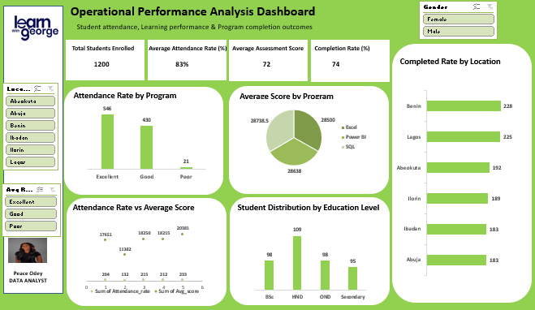

#  Operational Performance Analysis – Learn with George

**Tool Used:** Microsoft Excel (Dashboard & Pivot Tables)
**Project Type:** Operational Analytics | NGO Performance Analysis
**Time Period:** January – June 2025


##  Project Overview

This project analyzes operational performance data for **Learn with George**, a non-profit organization in Nigeria delivering free training programs in **Excel, SQL, and Power BI** across multiple locations.

The objective was to evaluate student attendance, assessment performance, and completion outcomes over six months to support data-driven decision-making and program improvement.


##  Problem Statement

Management required better visibility into:

* Student attendance trends
* Assessment performance across programs
* Completion rates by program and location
* Engagement gaps affecting outcomes

The goal was to identify underperforming programs or locations and highlight at-risk students requiring intervention.


##  Data Source

* **Dataset Type:** Learn with George NGO operational dataset
* **Timeframe:** January – June 2025
  

### Key Fields:

* Student ID
* Program (Excel, SQL, Power BI)
* Attendance Rate
* Assessment Score
* Completion Status
* Location
* Education Level
* Gender

---

##  Data Cleaning & Transformation

Data preparation was completed in Microsoft Excel:

* Removed duplicate records
* Handled missing values (attendance & assessment scores)
* Standardized program names and location labels
* Created calculated fields:

  * Average Attendance Rate
  * Completion Rate
* Built Pivot Tables to support dashboard visualizations


##  Data Modeling (Excel – Pivot Tables)

### Fact Data:

* Attendance
* Assessment Scores
* Completion Status

### Dimensions:

* Program
* Location
* Education Level
* Gender

Interactive analysis was enabled using:

* Pivot Tables
* Slicers
* KPI Cards


##  Key Performance Indicators (KPIs)

* **Total Students Enrolled**
* **Average Attendance Rate (%)**
* **Average Assessment Score**
* **Completion Rate (%)**


##  Measures Created

```excel
Total Students Enrolled = COUNT(Student ID)

Average Attendance Rate (%) = AVERAGE(Attendance Rate)

Average Assessment Score = AVERAGE(Assessment Score)

Completion Rate (%) = Completed Students / Total Students
```


##  Dashboard Visualizations



* Attendance Rate by Program
* Average Score by Program
* Completion Rate by Location
* Attendance Rate vs Assessment Score
* Student Distribution by Education Level


##  Key Insights

### 1️⃣ Overall Attendance Performance

Average attendance rate is approximately **83%**, indicating strong overall engagement.

### 2️⃣ Attendance by Program

Excel and SQL programs show higher attendance compared to Power BI, suggesting stronger engagement in foundational courses.

### 3️⃣ Student Performance by Program

Excel participants demonstrate slightly higher average assessment scores.

### 4️⃣ Completion Outcomes by Location

Benin and Lagos record the highest completion rates.
Abuja and Ibadan show relatively lower completion outcomes, indicating potential location-specific challenges.

### 5️⃣ Attendance vs Performance Relationship

Higher attendance correlates positively with higher assessment scores.

### 6️⃣ At-Risk Students

Students with low attendance and low assessment scores are significantly more likely not to complete the program.


##  Recommendations

* Implement structured attendance monitoring and follow-up systems
* Provide additional academic support in lower-performing locations
* Replicate best practices from high-performing centers
* Develop early-warning indicators based on attendance and performance thresholds

---

##  Conclusion

This Excel dashboard provides management with a clear operational overview of training performance across programs and locations.

The analysis demonstrates a strong link between attendance and learning outcomes, enabling early identification of at-risk students and underperforming locations.

Future enhancements may include:

* Trend analysis over multiple cohorts
* Cohort-based performance tracking
* Integration of student feedback data
* Migration to Power BI for advanced analytics


## Tools & Skills Demonstrated

* Microsoft Excel (Pivot Tables, Slicers, Dashboard Design)
* Data Cleaning & Transformation
* KPI Development
* Operational Performance Analysis
* Insight Generation & Business Recommendations


